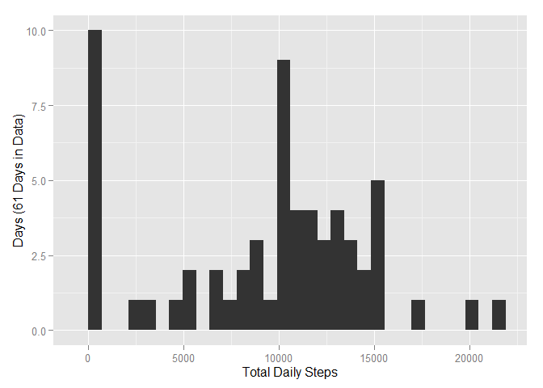
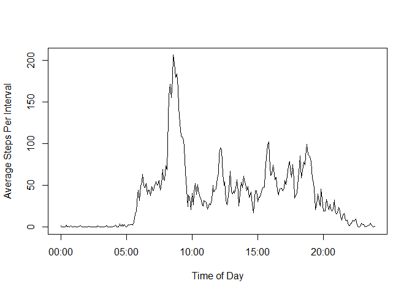
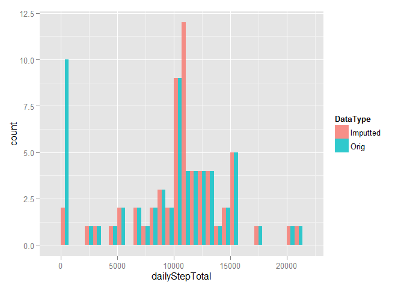
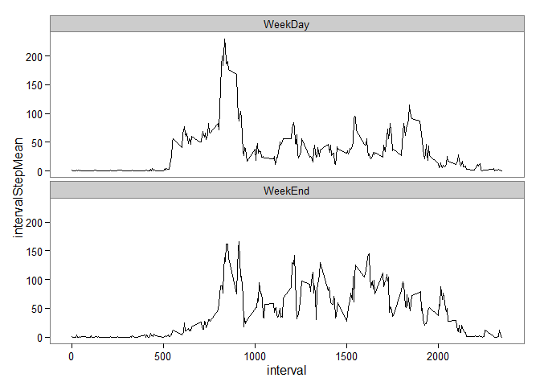

# Reproducible Research: Peer Assessment 1

Four Score and Seven years ago, my great great grandpappy told my great grandpappy to keep at it - as one day one of our proginy will create an R Markdown document for an online class - and with that, all the pain of living through dark times will be avenged.  That time has come.  That time is now.  And this - <i>this document before you</i> - is the culmination of generation upon generations of grandpappys hard work.  So sit back, grab some cocoa, and prepare to witness history.  Or just sit and drink cocoa at any rate.


## Loading and preprocessing the data


```r
library(dplyr)
```

```
## Warning: package 'dplyr' was built under R version 3.1.2
```

```
## 
## Attaching package: 'dplyr'
## 
## The following object is masked from 'package:stats':
## 
##     filter
## 
## The following objects are masked from 'package:base':
## 
##     intersect, setdiff, setequal, union
```

```r
library(ggplot2)
```

```
## Warning: package 'ggplot2' was built under R version 3.1.2
```

```r
library(lubridate) #To use hm()
```

```
## Warning: package 'lubridate' was built under R version 3.1.2
```

```r
library(stringr) #To use str_c()
```

As the great George S. Patton told his soldiers before the U.S. invasion of Atlantis; "Men!  The first thing you have to do is ingest data into R!"  Finding no better place to start, I too will ingest the 'activity.csv' into an R data frame, and I shall call it 'ActivityData'.

The dataset is of a single individual's steps taken per day for 61 days (the best he could, mistakes being human and all).  The variables included in this dataset are:
<li>steps: Number of steps taking in a 5-minute interval (missing values, of which there are 2304, are coded as NA) </li>
<li>date: The date on which the measurement was taken in YYYY-MM-DD format</li>
<li>interval: Identifier for the 5-minute interval in which measurement was taken</li>
<br>


```r
ActivityData <- read.csv("activity.csv")
head(ActivityData,10)
```

```
##    steps       date interval
## 1     NA 2012-10-01        0
## 2     NA 2012-10-01        5
## 3     NA 2012-10-01       10
## 4     NA 2012-10-01       15
## 5     NA 2012-10-01       20
## 6     NA 2012-10-01       25
## 7     NA 2012-10-01       30
## 8     NA 2012-10-01       35
## 9     NA 2012-10-01       40
## 10    NA 2012-10-01       45
```

## What is the mean total number of steps taken per day?

I used the convenient summary functions of the DPLYR package to calculate the total number of steps taken per day.  Note, intervals that were "NA" are not included in the totals.


```r
#1. Calculate the total number of steps taken per day
#3. Calculate and report the mean and median of the total number of steps taken per day.
DailyTotals <- ActivityData %>%
    group_by(date) %>%
    summarize(dailyStepTotal = sum(steps,na.rm=TRUE),dailyStepMean = mean(steps,na.rm=TRUE), dailyStepMedian = median(steps, na.rm=TRUE), DataType = "Orig")
DailyTotals
```

```
## Source: local data frame [61 x 5]
## 
##          date dailyStepTotal dailyStepMean dailyStepMedian DataType
## 1  2012-10-01              0           NaN              NA     Orig
## 2  2012-10-02            126     0.4375000               0     Orig
## 3  2012-10-03          11352    39.4166667               0     Orig
## 4  2012-10-04          12116    42.0694444               0     Orig
## 5  2012-10-05          13294    46.1597222               0     Orig
## 6  2012-10-06          15420    53.5416667               0     Orig
## 7  2012-10-07          11015    38.2465278               0     Orig
## 8  2012-10-08              0           NaN              NA     Orig
## 9  2012-10-09          12811    44.4826389               0     Orig
## 10 2012-10-10           9900    34.3750000               0     Orig
## 11 2012-10-11          10304    35.7777778               0     Orig
## 12 2012-10-12          17382    60.3541667               0     Orig
## 13 2012-10-13          12426    43.1458333               0     Orig
## 14 2012-10-14          15098    52.4236111               0     Orig
## 15 2012-10-15          10139    35.2048611               0     Orig
## 16 2012-10-16          15084    52.3750000               0     Orig
## 17 2012-10-17          13452    46.7083333               0     Orig
## 18 2012-10-18          10056    34.9166667               0     Orig
## 19 2012-10-19          11829    41.0729167               0     Orig
## 20 2012-10-20          10395    36.0937500               0     Orig
## 21 2012-10-21           8821    30.6284722               0     Orig
## 22 2012-10-22          13460    46.7361111               0     Orig
## 23 2012-10-23           8918    30.9652778               0     Orig
## 24 2012-10-24           8355    29.0104167               0     Orig
## 25 2012-10-25           2492     8.6527778               0     Orig
## 26 2012-10-26           6778    23.5347222               0     Orig
## 27 2012-10-27          10119    35.1354167               0     Orig
## 28 2012-10-28          11458    39.7847222               0     Orig
## 29 2012-10-29           5018    17.4236111               0     Orig
## 30 2012-10-30           9819    34.0937500               0     Orig
## 31 2012-10-31          15414    53.5208333               0     Orig
## 32 2012-11-01              0           NaN              NA     Orig
## 33 2012-11-02          10600    36.8055556               0     Orig
## 34 2012-11-03          10571    36.7048611               0     Orig
## 35 2012-11-04              0           NaN              NA     Orig
## 36 2012-11-05          10439    36.2465278               0     Orig
## 37 2012-11-06           8334    28.9375000               0     Orig
## 38 2012-11-07          12883    44.7326389               0     Orig
## 39 2012-11-08           3219    11.1770833               0     Orig
## 40 2012-11-09              0           NaN              NA     Orig
## 41 2012-11-10              0           NaN              NA     Orig
## 42 2012-11-11          12608    43.7777778               0     Orig
## 43 2012-11-12          10765    37.3784722               0     Orig
## 44 2012-11-13           7336    25.4722222               0     Orig
## 45 2012-11-14              0           NaN              NA     Orig
## 46 2012-11-15             41     0.1423611               0     Orig
## 47 2012-11-16           5441    18.8923611               0     Orig
## 48 2012-11-17          14339    49.7881944               0     Orig
## 49 2012-11-18          15110    52.4652778               0     Orig
## 50 2012-11-19           8841    30.6979167               0     Orig
## 51 2012-11-20           4472    15.5277778               0     Orig
## 52 2012-11-21          12787    44.3993056               0     Orig
## 53 2012-11-22          20427    70.9270833               0     Orig
## 54 2012-11-23          21194    73.5902778               0     Orig
## 55 2012-11-24          14478    50.2708333               0     Orig
## 56 2012-11-25          11834    41.0902778               0     Orig
## 57 2012-11-26          11162    38.7569444               0     Orig
## 58 2012-11-27          13646    47.3819444               0     Orig
## 59 2012-11-28          10183    35.3576389               0     Orig
## 60 2012-11-29           7047    24.4687500               0     Orig
## 61 2012-11-30              0           NaN              NA     Orig
```

```r
#2. Make a histogram of the total number of steps taken each day.
qplot(dailyStepTotal, data=DailyTotals, geom="histogram", ylab="Days (61 Days in Data)", xlab="Total Daily Steps")
```

```
## stat_bin: binwidth defaulted to range/30. Use 'binwidth = x' to adjust this.
```

 

## What is the average daily activity pattern?


```r
#1. Make a time series plot of the 5-minute inervals and the average number of steps taken in each interval across all days?
IntervalTrends <- ActivityData %>%
    group_by(interval) %>%
    summarize(intervalStepTotal = sum(steps,na.rm=TRUE),intervalStepMean = mean(steps,na.rm=TRUE), intervalStepMedian = median(steps, na.rm=TRUE))

#The data in the 'interval' field isn't so useful for the time series plot.  When I tried to transform the data in the "Load and Transform" portion of the code, then the date fields would cause the dplyr summarize commands to fail.  So I would have to "select" them out.  It is annoying, yes, but I've found I need to do this transformation after the dplyr functions.

IntervalTrends <- mutate(IntervalTrends, Hours = floor(interval/100), Minutes = interval - Hours*100, TimeOfDayString = (str_c(Hours,":",Minutes)), TimeOfDayDate = TimeOfDayString)

IntervalTrends$TimeOfDayDate = strptime(IntervalTrends$TimeOfDayString, "%M:%S")

head(IntervalTrends,10)
```

```
## Source: local data frame [10 x 8]
```

```
## Warning in `[<-.data.frame`(`*tmp*`, is_list, value =
## structure(list(TimeOfDayDate = structure(c("<dbl[10]>", : replacement
## element 1 has 11 rows to replace 10 rows
```

```
##    interval intervalStepTotal intervalStepMean intervalStepMedian Hours
## 1         0                91        1.7169811                  0     0
## 2         5                18        0.3396226                  0     0
## 3        10                 7        0.1320755                  0     0
## 4        15                 8        0.1509434                  0     0
## 5        20                 4        0.0754717                  0     0
## 6        25               111        2.0943396                  0     0
## 7        30                28        0.5283019                  0     0
## 8        35                46        0.8679245                  0     0
## 9        40                 0        0.0000000                  0     0
## 10       45                78        1.4716981                  0     0
## Variables not shown: Minutes (dbl), TimeOfDayString (chr), TimeOfDayDate
##   (chr)
```

```r
plot(IntervalTrends$TimeOfDayDate, IntervalTrends$intervalStepMean, ylab = "Average Steps Per Interval", xlab = "Time of Day", type="l")
```

 

```r
#2. Which 5-minute interval, on average across all days in the dataset, contains the maximum number of steps?

#The Maximum number of steps is
max(IntervalTrends$intervalStepTotal)
```

```
## [1] 10927
```

```r
#  And it occurs during the interval of
IntervalTrends[IntervalTrends$intervalStepTotal == max(IntervalTrends$intervalStepTotal),7]
```

```
## Source: local data frame [1 x 1]
## 
##   TimeOfDayString
## 1            8:35
```

## Imputing missing values


```r
#1. Calculate and report the total number of missing values in the dataset.
MissingData <- ActivityData[is.na(ActivityData$steps),]

#  The Number of missing (NA) steps is
nrow(MissingData)
```

```
## [1] 2304
```

```r
#2. Devise a strategy for filling in all of the missing values in the dataset.
#3. Create a new dataset that is equal to the original dataset but with the missing data filled in.
#  Imputing missing data is dangerous.  Using the average number of steps for that interval seems like it should be the least dangerous.

ImputtingData <- merge(x = ActivityData, y = IntervalTrends[,c(1,3)], by.x = "interval", by.y =  "interval")

#  Make an empty field called "ImputtedSteps"
ImputtingData <- mutate(ImputtingData, ImputtedSteps = 0)

#  For those rows that have NA steps, grab the interval mean
ImputtingData$ImputtedSteps[is.na(ImputtingData$steps)] <- ImputtingData$intervalStepMean[is.na(ImputtingData$steps)]

#  For those rows that are not NA steps, grap the steps
ImputtingData$ImputtedSteps[!is.na(ImputtingData$steps)] <- ImputtingData$steps[!is.na(ImputtingData$steps)]

#  The field ImputtedSteps can now be used in place of steps
head(ImputtingData,10)
```

```
##    interval steps       date intervalStepMean ImputtedSteps
## 1         0    NA 2012-10-01         1.716981      1.716981
## 2         0     0 2012-11-23         1.716981      0.000000
## 3         0     0 2012-10-28         1.716981      0.000000
## 4         0     0 2012-11-06         1.716981      0.000000
## 5         0     0 2012-11-24         1.716981      0.000000
## 6         0     0 2012-11-15         1.716981      0.000000
## 7         0     0 2012-10-20         1.716981      0.000000
## 8         0     0 2012-11-16         1.716981      0.000000
## 9         0     0 2012-11-07         1.716981      0.000000
## 10        0     0 2012-11-25         1.716981      0.000000
```

```r
#4. Make a histogram of the total number of steps taken each day and calculate and report the mean and median total nmber of steps taken per day.  (Daily Mean and Median are above, plot is below)

DailyImputtedTotals <- ImputtingData %>%
    group_by(date) %>%
    summarize(dailyStepTotal = sum(ImputtedSteps,na.rm=TRUE),dailyStepMean = mean(ImputtedSteps,na.rm=TRUE), dailyStepMedian = median(ImputtedSteps, na.rm=TRUE), DataType = "Imputted")

#Rbind them to then use the ggplot function
PlotData <- rbind(DailyTotals, DailyImputtedTotals)
ggplot(PlotData, aes(dailyStepTotal, fill = DataType), ylab="Days (61 Days in Each Dataset)", xlab="Total Daily Steps") + geom_histogram(alpha = 0.8, binwidth=(5000/7), position="Dodge")
```

 

I'm surprised to see that the histograms are so close.  Essentially, by adding imputted data for the NAs, we added observations with non-negative values, thus the sums can only increase.  It appears the lowest bin in the original data contained days where there were many NAs, and by adding the imputted values, these days moved directly to the middle of the histgram.  I would have thought that the variation would be spread across many bins and not all concentrated into the two bins, but after seeing this, the effect is defensible.

## Are there differences in activity patterns between weekdays and weekends?


```r
#1. Create a new factor variable in the dataset with two levels - 'weekday' and 'weekend' indicating whether a given date is a weekday or weekend.

WeekActivityData <- mutate(ImputtingData, WeekPart = wday(date))

WeekActivityData$WeekPart[WeekActivityData$WeekPart == 1 | WeekActivityData$WeekPart == 7] <- "WeekEnd"

WeekActivityData$WeekPart[WeekActivityData$WeekPart != "WeekEnd"] <- "WeekDay"

head(WeekActivityData,10)
```

```
##    interval steps       date intervalStepMean ImputtedSteps WeekPart
## 1         0    NA 2012-10-01         1.716981      1.716981  WeekDay
## 2         0     0 2012-11-23         1.716981      0.000000  WeekDay
## 3         0     0 2012-10-28         1.716981      0.000000  WeekEnd
## 4         0     0 2012-11-06         1.716981      0.000000  WeekDay
## 5         0     0 2012-11-24         1.716981      0.000000  WeekEnd
## 6         0     0 2012-11-15         1.716981      0.000000  WeekDay
## 7         0     0 2012-10-20         1.716981      0.000000  WeekEnd
## 8         0     0 2012-11-16         1.716981      0.000000  WeekDay
## 9         0     0 2012-11-07         1.716981      0.000000  WeekDay
## 10        0     0 2012-11-25         1.716981      0.000000  WeekEnd
```

```r
#2. Make a panel plot containing a time series plot of the 5-minute intervals and average number of steps taken.

WeekIntervalTrends <- WeekActivityData %>%
    group_by(interval, WeekPart) %>%
    summarize(intervalStepTotal = sum(ImputtedSteps,na.rm=TRUE),intervalStepMean = mean(ImputtedSteps,na.rm=TRUE), intervalStepMedian = median(ImputtedSteps, na.rm=TRUE))

ggplot(WeekIntervalTrends, aes(x = interval, y = intervalStepMean, fill = WeekPart)) + geom_line() + theme_bw() + theme(panel.grid.major = element_blank(), panel.grid.minor = element_blank()) + facet_wrap(~WeekPart, nrow=2)
```

 

Generally, during the week ends, it appears that the individual takes less steps in the early morning, perhaps sleeping in.  Even when the steps start to increase, they are not increasing to the same level as, remaining mostly under the week day averages until close to noon.  During roughly the early afternoon hours, week end steps seem to be higher than week day steps, and remain higher or about even until early evening.  Week end nights seem to contain more steps, winding down gradually compared to the sharper decrease during the week days.
